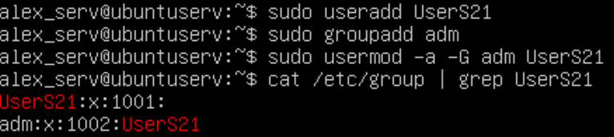
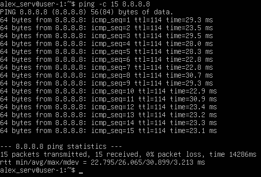

# Операционные системы UNIX/Linux (Базовый)
## Part 1. Установка ОС
1. Устанавливаем ISO-файл с образом системы с официального сайта [https://ubuntu.com](url)
2. Создаем VM в VirtualBox, подключаем к ней наш ISO.
3. Устанавливаем, настраиваем систему.
4. Проверка версии системы:

<figure>
    
    <figcaption>Вывод команды cat /etc/issue.</figcaption>
</figure>

## Part 2. Создание пользователя

<figure>
    
    <figcaption>Содание пользователя и добавление его в группу adm.</figcaption>
</figure>

#### Объяснение команд:
- `sudo useradd UserS21` – создает пользователя с именем UserS21;
- `sudo groupadd adm` – создает группу с именем adm;
- `sudo usermod -a -G adm UserS21` – добавляет пользователя с именем UserS21 в группу с именем adm;
- `cat /etc/group | grep UserS21` – выводит содержимое файла /etc/group, который содержит информацию о группах пользователей Linux. `grep UserS21` в нашем случае используется для фильтрации вывода команды `cat`, оставляя только те строки, которые содержат подстроку `UserS21`.

Проверяем наличие записи о новом пользователе в файле /etc/passwd:

<figure>
    
    <figcaption>Вывод команды cat /etc/passwd | grep UserS21.</figcaption>
</figure>

## Part 3. Настройка сети ОС
#### Имя машины
- Задаем новое название машины, используя команду `sudo hostnamectl set-hostname user-1`;
- Проверяем имя машины командой `hostnamectl`.

<figure>
    
    <figcaption>Вывод команды hostnamectl.</figcaption>
</figure>

#### Временная зона
- Устанавливаем временную зону по нашему местоположению при помощи команды `sudo timedatectl set-timezone Europe/Moscow`;
- Проверяем временную зону командой `timedatectl`.

<figure>
    
    <figcaption>Вывод команды timedatectl.</figcaption>
</figure>

#### Названия сетевых интерфейсов
- Выводим названия сетевых интерфейсов, используя команду `ifconfig`.

<figure>
    
    <figcaption>Вывод команды ifconfig.</figcaption>
</figure>

*Интерфейс lo устанавливается автоматически при загрузке системы в большинстве дистрибутивов Linux. Он является стандартным компонентом ядра Linux, который создается и настраивается при старте системы. Благодаря этому интерфейсу, пользовательские программы могут взаимодействовать друг с другом, используя стандартные сетевые протоколы, такие как TCP/IP, но без участия внешнего оборудования.*

#### DHCP
- Используя команду `ifconfig`, узнаем ip адрес устройства от DHCP.

<figure>
    
    <figcaption>Вывод команды ifconfig.</figcaption>
</figure>

- Теперь установим пакет для работы с dhclient, для этого используем команду `sudo apt install isc-dhcp-client`;
- Затем нам необходимо сбросить нынешний ip адрес устройства, сделаем это командой `sudo dhclient -r enp0s3`;
- Проверим вывод команды `ifconfig`, чтобы убедиться в том, что на данный момент у нас отстуствует ip адрес;

<figure>
    
    <figcaption>Вывод команды ifconfig.</figcaption>
</figure>

- Получаем новый ip адрес с использованием команды `sudo dhclient -v enp0s3`;

<figure>
    
    <figcaption>Команда dhclient -v отработала.</figcaption>
</figure>

- Вновь проверим вывод команды `ifconfig`, убедимся, что нам был присвоен новый ip адрес.

<figure>
    
    <figcaption>Вывод команды ifconfig.</figcaption>
</figure>

*DHCP (Dynamic Host Configuration Protocol) — это сетевой протокол, используемый для автоматического назначения IP-адресов устройствам в сети.*

#### IP адреса
- Узнаем свой внешний ip адрес командой `curl ifconfig.me/ip`;

<figure>
    
    <figcaption>Вывод команды curl ifconfig.me/ip.</figcaption>
</figure>

- Узнаем внутренний ip (gw/gateway) командой `route -n`.

<figure>
    
    <figcaption>Вывод команды route -n.</figcaption>
</figure>

#### Статический IP
**Для выполнения этого задания я проверяю содержимое директории /etc/netplan командой `ls`, там расположен файл 50-cloud-init.yaml, в него я и буду вносить правки.**

1. Открываю файл /etc/netplan/50-cloud-init.yaml в vim;
2. Меняю *''dhcp4: true''* на *''dhcp4: false''*, это необходимо сделать с целью отключения получения адреса от DHCP;
3. Задаем ip адрес и DNS (рекомендованные 1.1.1.1, 8.8.8.8);

<figure>
    
    <figcaption>Файл 50-cloud-init.yaml.</figcaption>
</figure>

4. Сохраняем настройки конфигурации: `sudo netplan apply && sudo netplan try`;
5. Перезапускаем систему командой `reboot`;
6. Используем ifconfig для проверки полученного ip;

<figure>
    
    <figcaption>Вывод команды ifconfig.</figcaption>
</figure>

7. Для проверки сети используем утилиту `ping`, пинганем хосты 1.1.1.1, 8.8.8.8 и ya.ru.

<figure>
    
    <figcaption>ping 1.1.1.1.</figcaption>
</figure>

<figure>
    
    <figcaption>ping 8.8.8.8.</figcaption>
</figure>

<figure>
    
    <figcaption>ping ya.ru.</figcaption>
</figure>

## Part 4. Обновление ОС
- Для обновления сис. пакетов воспользуемся командой `sudo apt upgrade`;
- После окончания выполнения команды проверим доступные обновления пакетов командой `sudo apt update`.

<figure>
    
    <figcaption>Вывод команды sudo apt update.</figcaption>
</figure>

## Part 5. Использование команды sudo
- Для выдачи привилегий суперпользователя пользователю UserS21, добавим его в группу sudo, для этого воспользуемся командой `sudo usermod -aG sudo UserS21 `;

<figure>
    
    <figcaption>Добавляем UserS21 в sudo.</figcaption>
</figure>

- Для переключения на пользователя UserS21 используем команду `su UserS21`, вводим пароль пользователя;
- Командой `whoami` убеждаемся, что являемся пользователем UserS21;
- Меняем имя машины командой `hostnamectl set-hostname user-21`;
- Проверяем имя машины.

<figure>
    
    <figcaption>Выполнение Part 5.</figcaption>
</figure>

## Part 6. Установка и настройка службы времени
- Для выполнения данного задания установим службу автоматической синхронизации, Chrony, командой `sudo apt install chrony`;
-  Выводим время часового пояса, в котором находимя, используя команду `date`; 

<figure>
    
    <figcaption>Вывод команды date.</figcaption>
</figure>

- Используем команду `timedatectl show` для отображения подробной информации о текущей конфигурации времени и даты.

<figure>
    
    <figcaption>Вывод команды timedatectl show.</figcaption>
</figure>

## Part 7. Установка и использование текстовых редакторов
#### Установка
- Для установки текстовых редакторов vim, nano, joe используем команду `sudo apt install vim nano joe`;
#### Редактирование файла с сохранением изменений
- Командой `touch` создаем три текстовых файла: test_vim.txt, test_nano.txt, test_joe.txt, а затем используя каждый из вышеуказанных редакторов напишем в каждом из файлов свой ник;
#### 1. VIM

<figure>
    
    <figcaption>Редактирование в vim с сохранением.</figcaption>
</figure>

*Для редактирования файла в vim необходимо нажать клавишу Insert. Для выхода из режима редактирования используется клавиша Esc. Для выхода из редактора с сохранением изменений необходимо написать команду `:wq` и нажать клавишу Enter.*

#### 2. NANO

<figure>
    
    <figcaption>Редактирование в nano с сохранением.</figcaption>
</figure>

*Для закрытия файла с сохранением изменений в nano необходимо зажать сочетание клавиш Ctrl+O, указать имя файла, зажать сочетание клавиш Ctrl+X.*

#### 3. JOE

<figure>
    
    <figcaption>Редактирование в joe с сохранением.</figcaption>
</figure>

*Для закрытия файла с сохранением изменений в joe необходимо зажать сочетание клавиш Ctrl+K, клавишу X.*

#### Редактирование файла без сохранения изменений
#### 1. VIM

<figure>
    
    <figcaption>Редактирование в vim без сохранения.</figcaption>
</figure>

*Для выхода из vim без сохранения изменений необходимо нажать клавишу Esc и написать команду `:q!`, нажать клавишу Enter.*

#### 2. NANO

<figure>
    
    <figcaption>Редактирование в nano без сохранения.</figcaption>
</figure>

*Для выхода из nano без сохранения изменений необходимо зажать сочетание клавиш Ctrl+X и отказаться от сохранения файла клавишей N.*

#### 3. JOE

<figure>
    
    <figcaption>Редактирование в joe без сохранения.</figcaption>
</figure>

*Для выхода из joe без сохранения изменений необходимо зажать сочетание клавиш Ctrl+K, клавишу C, а затем отказаться от сохранения файла.*

#### Поиск и замена слов
- Редактируем текстовые файлы по аналогии с предыдущим пунктом. Затем преступаем к поиску и замене содержимого файлов.
#### 1. VIM
*Для поиска содержимого в vim необходимо нажать клавишу Esc и ввести команду `/искомое_слово`, в нашем случае я буду искать слово "School", т.е. использую команду `/School`.*

<figure>
    
    <figcaption>Поиск в vim.</figcaption>
</figure>

*Для замены содержимого в vim необходимо использовать следующую команду: `:%s/искомое_слово/заменяющее_слово/g`, в нашем случае я буду менять слово "School" на "Oasis", т.е. использую команду `:%s/School/Oasis/g`.*

<figure>
    
    <figcaption>Замена в vim.</figcaption>
</figure>

#### 2. NANO
*Для поиска содержимого в nano необходимо зажать сочетание клавиш Ctrl+W, ввести необходимое слово.*

<figure>
    
    <figcaption>Поиск в nano.</figcaption>
</figure>

*Для замены содержимого найденного содержимого необходимо зажать сочетание кливиш Ctrl+R, ввести слово для замены.*

<figure>
    
    <figcaption>Замена в nano.</figcaption>
</figure>

#### 3. JOE
*Для поиска содержимого в joe необходимо зажать сочетание клавиш Ctrl+K, клавишу F, ввести искомое слово, чтобы joe понимал, что поиск ограничивается целым словом используем конструкцию* \\<слово\\>.

<figure>
    
    <figcaption>Поиск в joe.</figcaption>
</figure>

*Для замены содержимого в joe после нахождения искомого слова используем сочетание Ctrl+K, клавишу R, вводим необходимое слово для замены, нажимаем Enter, соглашаемся с изменением клавишей Y.*

<figure>
    
    <figcaption>Замена в joe.</figcaption>
</figure>

## Part 8. Установка и базовая настройка сервиса SSHD
- Для установки службы SSHd воспользуемся командой `sudo apt install ssh && sudo apt install openssh-server`;
- Добавляем автостарт службы командой `sudo systemctl enable ssh`;
- Чтобы перенастроить службу SSHd на порт 2022 отредактируем файл конфигурации SSHd в любом удобном текстовом редакторе, например в vim:
1. Открываем файл конфигурации в vim командой `vim /etc/ssh/ssh_config`.
2. Находим строку содержащую "Port 22", раскомментируем ее, убрав решетку слева, поменяем значение порта на "2022".
3. Выйдем из файла с сохранением изменений.

<figure>
    
    <figcaption>vim /etc/ssh/ssh_config.</figcaption>
</figure>

- Используем команду `ps -aux | grep sshd` для поиска процесса sshd, где `ps` – команда для вывода информации о процессах, ключ `-a` – выводит информацию о процессах всех пользователей, исключением являются фоновые процессы; ключ `-u` – добавляет информацию об имени пользователя и времени запуска процесса; ключ `-x` – выводит информацию о всех процессах в фоновом режиме; `|` – пайп для передачи вывода команды `ps` на вход команде `grep`; `grep` – команда для поиска строк по заданному шаблону.

<figure>
    
    <figcaption>Вывод команды ps -aux | grep sshd.</figcaption>
</figure>

- Перезагрузим систему командой `sudo reboot`;
- Используем команду `netstat -tan` для вывода списка открытых портов и соответствующих им адресов;

<figure>
    
    <figcaption>Вывод команды netstat -tan.</figcaption>
</figure>

**Ключи:**

`-t` – Показывает только соединения протокола TCP.

`-a` – Отображает все активные соединения и прослушивающие порты.

`-n` – Запрещает разрешение доменных имен и портов в читаемые имена, показывая их в числовом виде.

**Вывод команды:**

`Proto:` Протокол, используемый соединением.

`Recv-Q:` Количество байтов данных, полученных от удаленного хоста, но еще не прочитанных локальным приложением.

`Send-Q:` Количество байтов данных, отправленных локальной программой, но еще не подтвержденных удаленным хостом.

`Local Address:` Адрес и порт локального хоста.

`Foreign Address:` Адрес и порт удаленного хоста.

`State:` Текущее состояние соединения.

*0.0.0.0 -  это немаршрутизируемый адрес IPv4, который используется в качестве адреса по умолчанию или адреса-заполнителя.*

## Part 9. Установка и использование утилит top, htop
- Устанавливаем утилиты `top` и `htop` командой `sudo apt install top htop` 
- Запускаем утилиту `top`:

<figure>
    
    <figcaption>Вывод команды top.</figcaption>
</figure>

- **Вывод команды `top`:**

    - Uptime: 1 min (время работы системы);
    - Количество авторизованных пользователей: 1 user;
    - Средняя загрузка системы: 0,25, 0,11, 0,04;
    - Общее количество процессов: 162 total, 1 running, 161 sleeping, 0 stopped, 0 zombie;
    - Загрузка CPU: 0,0 us, 0,0 sy, 0,0 ni, 99,9 id, 0,0 wa, 0,0 hi, 0,1 si, 0,0 st;
    - Загрузка памяти (MIB Mem): 8193,1 total, 7783,5 free, 426,7 used, 215,6 buff/cache;
    - PID процесса, занимающего больше всего памяти: 1;
    - PID процесса, занимающего больше всего процессорного времени: 1;
- **Вывод команды htop:**

<figure>
    
    <figcaption>Вывод, отсортированный по PID.</figcaption>
</figure>

<figure>
    
    <figcaption>Вывод, отсортированный по PERCENT_CPU.</figcaption>
</figure>

<figure>
    
    <figcaption>Вывод, отсортированный по PERCENT_MEM.</figcaption>
</figure>

<figure>
    
    <figcaption>Вывод, отсортированный по TIME.</figcaption>
</figure>

<figure>
    
    <figcaption>Вывод htop процесса sshd.</figcaption>
</figure>

<figure>
    
    <figcaption>Вывод htop процесса syslog.</figcaption>
</figure>

<figure>
    
    <figcaption>Вывод htop с uptime, hostname, clock.</figcaption>
</figure>

## Part 10. Использование утилиты fdisk
- Запускаем команду `fdisk -l`:

<figure>
    
    <figcaption>Вывод команды fdisk -l.</figcaption>
</figure>

- Вывод команды `fdisk -l`:

    - Название диска: sda;

    - Размер диска: 25 GB;

    - Количество секторов: 52428800.

- Для получения размера swap используем команду `free -h`;

<figure>
    
    <figcaption>Вывод команды free -h.</figcaption>
</figure>

## Part 11. Использование утилиты df
- Запускаем команду `df`:

<figure>
    
    <figcaption>Вывод команды df.</figcaption>
</figure>

- Вывод команды `df` для корневого раздела:

    - Размер раздела: 11758760.
    - Размер занятого пространства: 2692396.
    - Размер свободного пространства: 8447256.
    - Процент использования: 25%.
    - Единица измерения в выводе: килобайт.
- Запускаем команду `df -Th`:

<figure>
    
    <figcaption>Вывод команды df -Th.</figcaption>
</figure>

- Вывод команды `df -Th` для корневого раздела:

    - Размер раздела: 12 GB.
    - Размер занятого пространства: 2,6 GB.
    - Размер свободного пространства: 8,1 GB.
    - Процент использования: 25%
    - Тип файловой системы: ext4.

## Part 12. Использование утилиты du

- Запускаем команду `du`:

<figure>
    
    <figcaption>Вывод команды du.</figcaption>
</figure>

- Для вывода размеров директорий /home, /var, /var/log в байтах используем команду `sudo du -sb /var/log /home /var`.

<figure>
    
    <figcaption>Вывод команды sudo du -sb /var/log /home /var.</figcaption>
</figure>

- Для вывода размеров директорий /home, /var, /var/log в человекочитаемом виде, используем команду `sudo du -sh /var/log /home /var`.

<figure>
    
    <figcaption>Вывод команды sudo du -sh /var/log /home /var.</figcaption>
</figure>

- Для вывода размера всего содержимого в директории /var/log, используем команду `du -h /var/log/*`.

<figure>
    
    <figcaption>Вывод команды du -h /var/log/*.</figcaption>
</figure>

## Part 13. Установка и использование утилиты ncdu
- Устанавливаем утилиту ncdu командой `sudo apt install ncdu`.

- Для вывода размера директории /home при помощи утилиты ncdu используем команду `ncdu /home`.

<figure>
    
    <figcaption>Вывод команды ncdu /home.</figcaption>
</figure>

- Для вывода размера директории /var при помощи утилиты ncdu используем команду `ncdu /var`.

<figure>
    
    <figcaption>Вывод команды ncdu /var.</figcaption>
</figure>

- Для вывода размера директории /var при помощи утилиты ncdu используем команду `ncdu /var/log`.

<figure>
    
    <figcaption>Вывод команды ncdu /var/log.</figcaption>
</figure>

## Part 14. Работа с системными журналами

- Для просмотра содержимого /var/log/dmesg используем команду `cat /var/log/dmesg`.

- Для просмотра содержимого /var/log/syslog используем команду `cat /var/log/syslog`.

- Для просмотра содержимого /var/log/auth.log используем команду `cat /var/log/auth.log`.

#### Информация о последней успешной авторизации

<figure>
    
    <figcaption>Вывод команды cat /var/log/auth.log.</figcaption>
</figure>

1. Время последней успешной авторизации: 2024-12-14 20\:25:26.
2. Имя пользователя: alex_serv.
3. Метод входа: авторизация происходит через pam_unix модуль, т.е. аутентификация выполняется через проверку пароля пользователя в /etc/passwd и /etc/shadow.
#### Перезапуск службы SSHd
- Для перезапуска службы SSHd используем команду `sudo systemctl restart sshd`.
- Проверяем сис. логи, чтобы проверить, что служба SSHd действительно перезапустилась, командой `cat /var/log/syslog`.

<figure>
    
    <figcaption>Вывод команды cat /var/log/syslog.</figcaption>
</figure>

## Part 15. Использование планировщика заданий CRON
#### Использование CRON
- Для выполнения данного задания откроем крон-файл (crontab) для редактирования расписания задач командой `crontab -e`.
- Для добавления задачи, которая будет каждые 2 минуты запускать команду `uptime`, необходимо добавить следующую строчку в крон-файл: */2 * * * * uptime.

<figure>
    
    <figcaption>Добавляем задачу в crontab.</figcaption>
</figure>

- Для вывода списка текущих задач CRON используем команду `crontab -l`.

<figure>
    
    <figcaption>Вывод команды crontab -l.</figcaption>
</figure>

- Проверяем логи для, чтобы убедиться в выполнении задач.

<figure>
    
    <figcaption>Логи со строчками о выполнении задач CRON.</figcaption>
</figure>

#### Удаление задач из CRON
- Для удаления всех задач из планировщика, необходимо воспользоваться командой `crontab -r`.

<figure>
    
    <figcaption>Удаляем задачи из CRON, проверяем отсутствие задач.</figcaption>
</figure>

