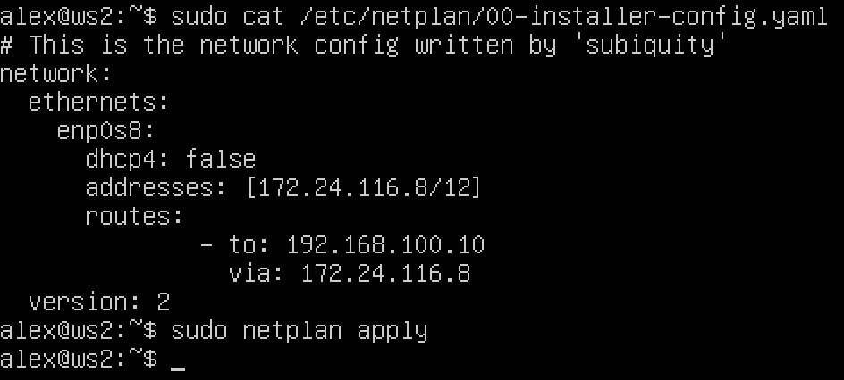
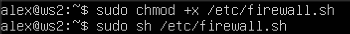
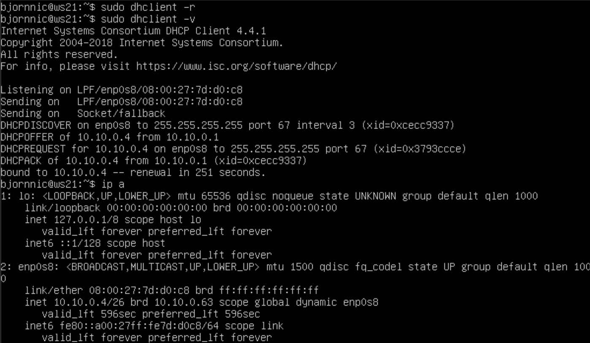
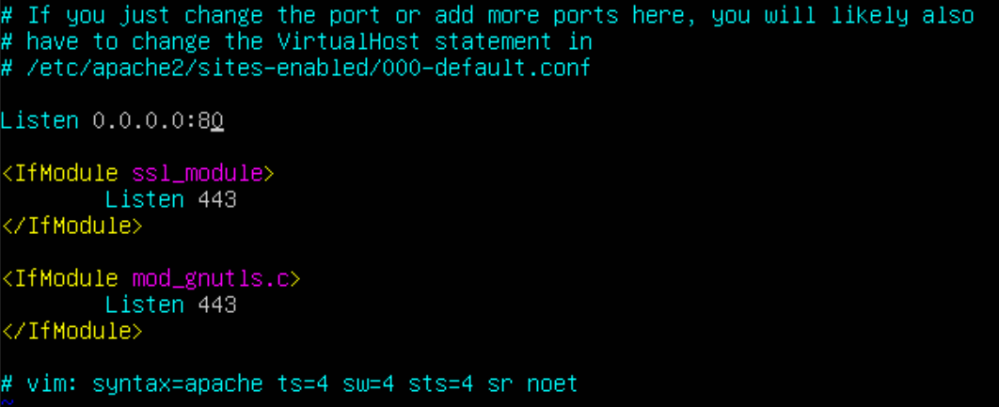
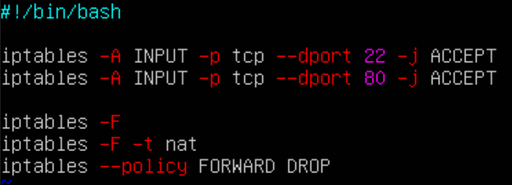
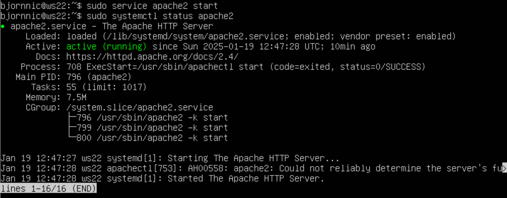

# Сети в Linux
## Part 1. Инструмент ipcalc
### 1.1. Сети и маски
1) **Адрес сети 192.167.38.54/13**
<figure>
    
    <figcaption>Вывод команды ipcalc 192.167.38.54/13</figcaption>
</figure>

2) **Перевод маски 255.255.255.0 в префиксную и двоичную запись, /15 в обычную и двоичную, 11111111.11111111.11111111.11110000 в обычную и префиксную**
<figure>
    
    <figcaption>Перевод 255.255.255.0 в префиксную и двоичную.</figcaption>
</figure>
<figure>
    
    <figcaption>Перевод /15 в обычную и двоичную.</figcaption>
</figure>
<figure>
    
    <figcaption>Перевод 11111111.11111111.11111111.11110000 в обычную и префиксную.</figcaption>
</figure>

3) **Минимальный и максимальный хост в сети 12.167.38.4 при масках: /8, 11111111.11111111.00000000.00000000, 255.255.254.0 и /4**
<figure>
    
    <figcaption>Вывод команды ipcalc 12.167.38.4/8</figcaption>
</figure>

- Минимальный хост в сети 12.167.38.4 при маске /8 - 12.0.0.1

- Максимальный хост в сети 12.167.38.4 при маске /8 - 12.255.255.254
<figure>
    
    <figcaption>Вывод команды ipcalc 12.167.38.4/16</figcaption>
</figure>

- Минимальный хост в сети 12.167.38.4 при маске 11111111.11111111.00000000.00000000 - 12.167.0.1
- Максимальный хост в сети 12.167.38.4 при маске 11111111.11111111.00000000.00000000 - 12.167.255.254
<figure>
    
    <figcaption>Вывод команды ipcalc 12.167.38.4/255.255.254.0</figcaption>
</figure>

- Минимальный хост в сети 12.167.38.4 при маске 255.255.254.0 - 12.167.38.1
- Максимальный хост в сети 12.167.38.4 при маске 255.255.254.0 - 12.167.39.254
<figure>
    
    <figcaption>Вывод команды ipcalc 12.167.38.4/4</figcaption>
</figure>

- Минимальный хост в сети 12.167.38.4 при маске /4 - 0.0.0.1
- Максимальный хост в сети 12.167.38.4 при маске /4 - 15.255.255.254

### 1.2. localhost

**Определить и записать в отчёт, можно ли обратиться к приложению, работающему на localhost, со следующими IP: 194.34.23.100, 127.0.0.2, 127.1.0.1, 128.0.0.1**

Приложение, работающее на localhost, доступно только через IP-адреса из диапазона обратной связи `127.0.0.0/8`.
 
1) **194.34.23.100** - адрес не входит в диапазон 127.0.0.0/8, обращение невозможно.

2) **127.0.0.2** - адрес входит в диапазон 127.0.0.0/8, обращение возможно.

3) **127.1.0.1** - адрес входит в диапазон 127.0.0.0/8, обращение возможно. 

4) **128.0.0.1** - адрес не входит в диапазон 127.0.0.0/8, обращение невозможно.

### 1.3. Диапазоны и сегменты сетей

1) **Какие из перечисленных IP можно использовать в качестве публичного, а какие только в качестве частных: 10.0.0.45, 134.43.0.2, 192.168.4.2, 172.20.250.4, 172.0.2.1, 192.172.0.1, 172.68.0.2, 172.16.255.255, 10.10.10.10, 192.169.168.1**

Частные IP-адреса включают следующие диапазоны:

- **10.0.0.0/8** (от 10.0.0.0 до 10.255.255.255)
- **172.16.0.0/12** (от 172.16.0.0 до 172.31.255.255)
- **192.168.0.0/16** (от 192.168.0.0 до 192.168.255.255)

Проверяем адреса, данные в задании:

- **10.0.0.45** - частный адрес, т.к. входит в диапазон 10.0.0.0/8
- **134.43.0.2** - является публичным адресом
- **192.168.4.2** - частный адрес, т.к. входит в диапазон 192.168.0.0/16
- **172.20.250.4** - частный адрес, т.к. входит в диапазон 172.16.0.0/12
- **172.0.2.1** - частный адрес, т.к. входит в диапазон 172.16.0.0/12
- **192.172.0.1** - является публичным адресом
- **172.68.0.2** - частный адрес, т.к. входит в диапазон 172.16.0.0/2
- **172.16.255.255** - частный адрес, т.к. входит в диапазон 172.16.0.0/12
- **10.10.10.10** - частный адрес, т.к. входит в диапазон 10.0.0.0/8
- **192.169.168.1** - является публичным адресом

2) **Какие из перечисленных IP-адресов шлюза возможны у сети 10.10.0.0/18: 10.0.0.1, 10.10.0.2, 10.10.10.10, 10.10.100.1, 10.10.1.255**

Определим диапазон сети 10.10.0.0/18 при помощи команды `ipcalc`:
<figure>
    
    <figcaption>Вывод команды ipcalc 10.10.0.0/18</figcaption>
</figure>

- Диапазон адресов для сети 10.10.0.0/18 - от 10.10.0.1 до 10.10.63.254.

Проверяем адреса, данные в задании:

- **10.0.0.1** - не подходит
- **10.10.0.2** - подходит
- **10.10.10.10** - подходит

- **10.10.100.1** - не подходит
- **10.10.1.255** - подходит

## Part 2. Статическая маршрутизация между двумя машинами

- Поднимаем две виртуальные машины
<figure>
    
    <figcaption>Названия и статус работы виртуальных машин.</figcaption>
</figure>

- С помощью команды `ip a` просмотрим существующие сетевые интерфейсы:
<figure>
    
    <figcaption>Сетевые интерфейсы ws1.</figcaption>
</figure>

<figure>
    
    <figcaption>Сетевые интерфейсы ws2.</figcaption>
</figure>

**Опиши сетевой интерфейс, соответствующий внутренней сети, на обеих машинах и задай следующие адреса и маски: ws1 — 192.168.100.10, маска /16, ws2 — 172.24.116.8, маска /12.**

### WS1
1) Вносим необходимые правки в файл etc/netplan/00-installer-config.yaml:
<figure>
    
    <figcaption>Содержимое файла etc/netplan/00-installer-config.yaml после сохранения изменений.</figcaption>
</figure>

2) Выполняем перезапуск сервиса сети:
<figure>
    
    <figcaption>Перезапуск сервиса сети.</figcaption>
</figure>

3)  Проверяем изменения:
<figure>
    
    <figcaption>Сетевые интерфейсы ws1.</figcaption>
</figure>

### WS2
1) Вносим необходимые правки в файл etc/netplan/00-installer-config.yaml:
<figure>
    
    <figcaption>Содержимое файла etc/netplan/00-installer-config.yaml после сохранения изменений</figcaption>
</figure>

2) Выполняем перезапуск сервиса сети:
<figure>
    
    <figcaption>Перезапуск сервиса сети.</figcaption>
</figure>

3)  Проверяем изменения:
<figure>
    
    <figcaption>Сетевые интерфейсы ws2.</figcaption>
</figure>

### 2.1. Добавление статического маршрута вручную

1) Для добавления статического маршрута между ВМ прежде всего необходимо соблюсти условие: обе ВМ должны находиться в одной физической или логической сети. Для этого выключаем виртуальные машины ws1 и ws2, переходим к их настройки в VirtualBox, выбираем вкладку "Сеть", чего выбираем в качестве адаптера "внутреннюю сеть", задаем ей название, после этого можно переходить к добавлению маршрута непосредственно в системе.

2) На ws1 при помощи команды sudo `ip r add 172.24.116.8 dev enp0s8` добавляем маршрут к машине ws2, командой `ip r` проверяем, что маршрут успешно добавился.
<figure>
    
    <figcaption>Добавление маршрута от ws1 к ws2.</figcaption>
</figure>

3) Аналогичныедействия проделываем на машине ws2.
<figure>
    
    <figcaption>Добавление маршрута от ws2 к ws1.</figcaption>
</figure>

4) Пингуем соединение между машинами:
<figure>
    
    <figcaption>ping 172.24.116.8</figcaption>
</figure>
<figure>
    
    <figcaption>ping 192.168.100.10</figcaption>
</figure>

### 2.2. Добавление статического маршрута с сохранением

1) После перезапуска машины проверяем маршруты командой `ip r`, убеждаемся, что маршруты не сохранились.
<figure>
    
    <figcaption>Маршруты ws1.</figcaption>
</figure>
<figure>
    
    <figcaption>Маршруты ws2.</figcaption>
</figure>

2) Добавляем маршруты в файлы 00-installer-config.yaml:
<figure>
    
    <figcaption>Содержимое файла etc/netplan/00-installer-config.yaml ws1 после сохранения изменений.</figcaption>
</figure>
<figure>
    
    <figcaption>Содержимое файла etc/netplan/00-installer-config.yaml ws2 после сохранения изменений.</figcaption>
</figure>

3) Пингуем соединение между машинами:
<figure>
    
    <figcaption>ping 172.24.116.8</figcaption>
</figure>
<figure>
    
    <figcaption>ping 192.168.100.10</figcaption>
</figure>

## Part 3. Утилита iperf3
### 3.1. Скорость соединения

- 8 Mbps = 1 MB/s;
- 100 MB/s = 819,200 Kbps;
- 1 Gbps = 1024 Mbps.

### 3.2. Утилита iperf3

- Для использования утилиты iperf3 используем команду `iperf3 -s` на ws1 (в таком случае она выступает в роли сервера).
<figure>
    
    <figcaption>Использование команды iperf3 -s</figcaption>
</figure>

- Затем используем команду iperf3 -c 192.168.100.10 на ws2 (в таком случае она выступает в роли клиента).
<figure>
    
    <figcaption>Использование команды iperf3 -c 192.168.100.10</figcaption>
</figure>

## Part 4. Сетевой экран
### 4.1. Утилита iptables

1) Создаем файл /etc/firewall.sh;
2) Следуя правилам из задания запоняем файлы содержимым:
<figure>
    
    <figcaption>Содержимое файла /etc/firewall.sh на ws1.</figcaption>
</figure>
<figure>
    
    <figcaption>Содержимое файла /etc/firewall.sh на ws2.</figcaption>
</figure>

3) Теперь предоставим право доступ к исполнению файла командой `sudo chmod +x /ect/firewall.sh` и запустим файл командый `sudo sh /etc/firewall.sh`:
<figure>
    
    <figcaption>Делаем файл /etc/firewall.sh исполняемым и запукскаем на ws1</figcaption>
</figure>
<figure>
    
    <figcaption>Делаем файл /etc/firewall.sh исполняемым и запукскаем на ws2.</figcaption>
</figure>

- Мы используем две стратегии брандмауэра - **"Default Deny"**, **"Default Allow"**. Их различие заключается в том, что в первом случае все потоки данных блокируются по умолчанию, если не указано явно разрешенный порт или сервис, во втором случае всякий трафик допускается по умолчанию, если не задано правило блокировки конкретного потока. **Default Deny** подходит для задач, где важна максимальная защита от непредвиденного поведения сети. **Default Allow**, напротив, используется, когда требуется лёгкое управление сетью, при этом сохраняется необходимость контроля за отдельными потоками.

### 4.2. Утилита nmap

- Находим машину, которая не "пингуется" командой `ping`, затем используем команду `nmap`, чтобы показать, что хост машины запущен:
<figure>
    
    <figcaption>Ищем "непингуемую" машину командой ping.</figcaption>
</figure>
<figure>
    
    <figcaption>Находим "непингуемую" машину командой ping, проверяем запущен ли ее хост при помощи команды nmap.</figcaption>
</figure>

- Сохраняем дампы образов виртуальных машин:
<figure>
    
    <figcaption>Дампы образов виртуальных машин.</figcaption>
</figure>

## Part 5. Статическая маршрутизация сети

**Поднимаем 5 виртуальных машин согласно условиям задачи:**
<figure>
    
    <figcaption>Рисунок сети из задания.</figcaption>
</figure>

### 5.1. Настройка адресов машин
- Настраиваем конфигурации машин в etc/netplan/00-installer-config.yaml согласно сети на рисунке:
<figure>
    
    <figcaption>Конфигурация ws11.</figcaption>
</figure>

<figure>
    
    <figcaption>Конфигурация ws21.</figcaption>
</figure>

<figure>
    
    <figcaption>Конфигурация ws22.</figcaption>
</figure>

<figure>
    
    <figcaption>Конфигурация r1.</figcaption>
</figure>

<figure>
    
    <figcaption>Конфигурация r2.</figcaption>
</figure>

- Применяем изменения файла конфигураций командам `sudo netplan apply`, перезапускаем сетевые службы командами `sudo systemctl restart systemd-networkd`, `sudo systemctl restart networkd-dispatcher.service`, затем проверяем, что адреса машин заданы верно:
<figure>
    
    <figcaption>Вывод команды ip -4 a на ws11.</figcaption>
</figure>

<figure>
    
    <figcaption>Вывод команды ip -4 a на ws21.</figcaption>
</figure>

<figure>
    
    <figcaption>Вывод команды ip -4 a на ws22.</figcaption>
</figure>

<figure>
    
    <figcaption>Вывод команды ip -4 a на r1.</figcaption>
</figure>

<figure>
    
    <figcaption>Вывод команды ip -4 a на r2.</figcaption>
</figure>

- Пингуем ws22 с ws21, r1 с ws11:
<figure>
    
    <figcaption>ping 10.20.0.20</figcaption>
</figure>
<figure>
    
    <figcaption>ping 10.10.0.1 10.100.0.11</figcaption>
</figure>

### 5.2. Включение переадресации IP-адресов

1) Для включения переадресации IP выполняем команду `sysctl -w net.ipv4.ip_forward=1` на r1 и r2:
<figure>
    
    <figcaption>Вызов и вывод команды sysctl -w net.ipv4.ip_forward=1</figcaption>
</figure>
<figure>
    
    <figcaption>Вызов и вывод команды sysctl -w net.ipv4.ip_forward=1</figcaption>
</figure>

2) Открываем файл /etc/sysctl.conf, добавляем в него строку net.ipv4_ip_forward = 1:
<figure>
    
    <figcaption>Включаем переадресацию IP на постоянной основе на r1.</figcaption>
</figure>
<figure>
    
    <figcaption>Включаем переадресацию IP на постоянной основе на r2.</figcaption>
</figure>

### 5.3. Установка маршрута по умолчанию

- Настраиваем маршрут по-умолчанию для рабочих станций. Для этого настраиваем конфигурацию на машинах ws11, ws21, ws22:
<figure>
    
    <figcaption>Netplan ws11.</figcaption>
</figure>
<figure>
    
    <figcaption>Netplan ws21.</figcaption>
</figure>
<figure>
    
    <figcaption>Netplan ws22.</figcaption>
</figure>

- Проверяем наши маршруты на рабочих станциях командой `ip r`:
<figure>
    
    <figcaption>Вывод команды ip r на ws11.</figcaption>
</figure>
<figure>
    
    <figcaption>Вывод команды ip r на ws21.</figcaption>
</figure>
<figure>
    
    <figcaption>Вывод команды ip r на ws22.</figcaption>
</figure>

- Пингуем r2 с ws11, чтобы показать, что пинг проходит, используем команду `tcpdump -tn -i enp0s9`. Поскольку на роутере не настроена маршрутизауия пакетов, мы не получим ответ на рабочую станцию, данная команды позволит увидеть, что сигнал доходит до роутера:
<figure>
    
    <figcaption>ping 10.100.0.12</figcaption>
</figure>
<figure>
    
    <figcaption>Вывод команды tcpdump -tn -i enp0s9</figcaption>
</figure>

### 5.4. Добавление статических маршрутов
- Добавляем в роутеры r1 и r2 маршруты в файфе конфигураций:
<figure>
    
    <figcaption>Файл конфигураций r1.</figcaption>
</figure>
<figure>
    
    <figcaption>Файл конфигураций r2.</figcaption>
</figure>

- Используем команду ip r, чтобы показать таблицы с маршрутами на роутерах:
<figure>
    
    <figcaption>Вывод команды ip r на r1.</figcaption>
</figure>
<figure>
    
    <figcaption>Вывод команды ip r на r2.</figcaption>
</figure>

- Запускаем команды `ip r list 10.10.0.0/18` и `ip r list 0.0.0.0/0` на ws11:
<figure>
    
    <figcaption>Вывод команд ip r  list 10.10.0.0/18 и ip r  list 0.0.0.0/0 на ws11.</figcaption>
</figure>

- Маршруты в таблице маршрутизации выбираются по принципу "самый точный". Если для одного и того же адреса подходят несколько маршрутов, то выбирается тот, у которого маска длиннее (то есть он более специфичен). Поэтому, когда пакет отправляется в сеть 10.10.0.0/18, маршрутизатор выберет именно этот маршрут, а не маршрут по умолчанию 0.0.0.0/0, потому что он точнее описывает направление для данного пакета.

### 5.5. Построение списка маршрутизаторов

- Перехватываем трафик на r1 при помощи команды `tcpdump -tnv -i enp0s8`:
<figure>
    
    <figcaption>Вывод команды tcpdump -tnv -i enp0s8 на r1.</figcaption>
</figure>

- При помощи `traceroute 10.20.0.10` получаем список маршрутизаторов на пути от ws11 до ws21:
<figure>
    
    <figcaption>Результат работы команды traceroute 10.20.0.10 на ws11.</figcaption>
</figure>

- Сначала traceroute отправляет пакет с TTL, установленным на 1, каждый маршрутизатор вдоль пути уменьшает значение TTL на 1. Когда TTL становится равным 0, маршрутизатор генерирует ICMP-ответ и отправляет его обратно источнику. Получив этот ответ, traceroute записывает IP-адрес и время ответа первого маршрутизатора. Затем traceroute повторяет процесс, отправляя следующий пакет с TTL, увеличенным на 1. Этот пакет проходит через следующий маршрутизатор, который также генерирует ICMP-ответ. Процесс продолжается до тех пор, пока пакет не достигнет целевого хоста. Последний маршрутизатор перед целевым хостом также генерирует ICMP-ответ, но в отличие от промежуточных маршрутизаторов, целевой хост сам генерирует ICMP-ответ "Port Unreachable", указывая, что пакет достиг своего конечного пункта назначения.

### 5.6. Использование протокола ICMP при маршрутизации

- Запускаем перехват сетевого трафика на r1:
<figure>
    
    <figcaption>Вывод команды tcpdump -n -i enp0s8 icmp</figcaption>
</figure>

- Пингуем несуществующий IP:
<figure>
    
    <figcaption>Ping 10.30.0.111</figcaption>
</figure>

## Part 6. Динамическая настройка IP с помощью DHCP
### Router 2, ws21, ws22
- Настраиваем конфигурацию службы DHCP для r2:
<figure>
    
    <figcaption>Содержимое файла /etc/dhcp/dhcpd.conf на r2.</figcaption>
</figure>
<figure>
    
    <figcaption>Содержимое файла resolv.conf на r2.</figcaption>
</figure>

- Перезагружаем службу командой `systemctl restart isc-dhcp-server`:
<figure>
    
    <figcaption>Перезапуск службы на r2.</figcaption>
</figure>

- Перезапускаем машину ws21 командой `reboot`, выполняем команду `ip a`, чтобы убедиться, что машина получила адрес:
<figure>
    
    <figcaption>Вывод команды ip a на ws21.</figcaption>
</figure>

- Пингуем ws22 с ws21:
<figure>
    
    <figcaption>Ping 10.20.0.2</figcaption>
</figure>

### Router 1, ws11
- Указываем MAC-адрес у ws11, для этого в etc/netplan/00-installer-config.yaml надо добавить строки: macaddress: 10:10:10:10:10:BA, dhcp4: true:
<figure>
    
    <figcaption>Содержимое файла etc/netplan/00-installer-config.yaml на ws11.</figcaption>
</figure>

- Настраиваем конфигурацию службы DHCP на r1, по аналогии с r2 указываем адрем роутера, адрес внутренней сети, DNS-сервер. Делаем выдачу адресов с жесткой привязкой к MAC-адресу:
<figure>
    
    <figcaption>Содержимое файла /etc/dhcp/dhcpd.conf на r1.</figcaption>
</figure>
<figure>
    
    <figcaption>Содержимое файла resolv.conf на r1.</figcaption>
</figure>

- Перезагружаем службу командой `systemctl restart isc-dhcp-server`:
<figure>
    
    <figcaption>Перезапуск службы на r1.</figcaption>
</figure>

- Перезапускаем машину ws11 командой `reboot`, выполняем команду `ip a`, чтобы убедиться, что машина получила адрес:
<figure>
    
    <figcaption>Вывод команды ip a на ws11.</figcaption>
</figure>

- Пингуем r1 с ws11:
<figure>
    
    <figcaption>Ping 10.10.0.1</figcaption>
</figure>

### Запрос обновления IP-адреса у DHCP

- В отчёт необходимо поместить скрины до и после обновления адреса, скриншот до:
<figure>
    
    <figcaption>Вывод команды ip a на ws21.</figcaption>
</figure>

- Удаляем старый адрес командой sudo dhclient -r, затем запрашиваем новый адрес командой sudo dhclient -v, проверяем командой ip a, что все получилось:
<figure>
    
    <figcaption>Вывод команды ip a на ws21.</figcaption>
</figure>

### Описание использованных опций DCHP-сервера

**subnet** - Описывает подсеть, которую обслуживает DHCP-сервер.

**range** - Диапазон адресов, который будет выдаваться клиентам.

**option routers** - Определяет шлюз по умолчанию (маршрутизатор), через который клиенты должны отправлять пакеты за пределы своей локальной сети.

**option domain-name-servers** - Указывает DNS-серверы, которые будут использоваться клиентами.

**host** - Статическая привязка MAC-адресов к конкретным IP-адресам.

**fixed address** - Назначение фиксированного (статического) IP-адреса конкретному устройству на основании его MAC-адреса.

**hardware ethernet** - Для указания MAC-адреса устройства, которому назначается определенный IP-адрес.

## Part 7. NAT
1) Делаем сервер Apache2 на ws22 и r1 общедоступным:
- В файле /etc/apache2/ports.conf меняем строку Listen 80 на Listen 0.0.0.0:80.
<figure>
    
    <figcaption>Содержимое файла /etc/apache2/ports.conf на ws22.</figcaption>
</figure>
<figure>
    
    <figcaption>Содержимое файла /etc/apache2/ports.conf на r1.</figcaption>
</figure>

2) Запускаем веб-сервер Apache командой `sudo service apache2 start` на ws22, r1:
<figure>
    
    <figcaption>Использование команды sudo service apache2 start на ws22.</figcaption>
</figure>
<figure>
    
    <figcaption>Использование команды sudo service apache2 start на r1.</figcaption>
</figure>

3) Добавляем в фаервол на r2 правила из задания, запускаем его как в Части 4, проверяем соединение между ws22 и r1 командой `ping`:
<figure>
    
    <figcaption>Содержимое фаервола на r2.</figcaption>
</figure>
<figure>
    
    <figcaption>Запуск фаервола на r2.</figcaption>
</figure>
<figure>
    
    <figcaption>Ping 10.10.0.1</figcaption>
</figure>

4) Разрешаем маршрутизацию всех пакетов протокола ICMP:

- Добавляем новое правило в фаервол на r2:
<figure>
    
    <figcaption>Содержимое фаервола на r2.</figcaption>
</figure>

- Запускаем файл как в Части 4, проверяем соединение между ws22 и r1 командой `ping`:
<figure>
    
    <figcaption>Ping 10.10.0.1</figcaption>
</figure>

5) Включаем SNAT, DNAT согласно заданию:

- Добавляем правила в фаервол на r2:
<figure>
    
    <figcaption>Содержимое фаервола на r2.</figcaption>
</figure>

- Запускаем файл как в Части 4, проверяем соединение по TCP для SNAT и DNAT, для этого подключаемся с ws22 к серверу Apache на r1 командой `telnet [адрес] [порт]`, с r1 к серверу Apache на ws22 командой `telnet [адрес r2] [порт 8080]`:
<figure>
    
    <figcaption>Вывод команды telnet 10.100.0.11 80</figcaption>
</figure>
<figure>
    
    <figcaption>Вывод команды telnet 10.100.0.12 8080</figcaption>
</figure>

## Part 8. Дополнительно. Знакомство с SSH Tunnels

1) Запускаем на r2 фаервол с правилами из Части 7.

2) Запускаем веб-сервер Apache на ws22, только на localhost (т.е. в файле /etc/apache2/ports.conf меняем строку `Listen 80` на `Listen localhost:80`):
<figure>
    
    <figcaption>Содержимое файла /etc/apache2/ports.conf на ws22.</figcaption>
</figure>

- Запускаем сервер, проверяем работу веб-сервера командой `sudo systemctl status apache2`:
<figure>
    
    <figcaption>Вывод команды sudo systemctl status apache2</figcaption>
</figure>

3) Воспользуемся Local TCP forwarding с ws21 до ws22:

- Для этого используем команду `ssh -L`, она создает туннель, который перенаправляет трафик с локальной машины на удаленную машину через SSH-соединение.
<figure>
    
    <figcaption>Использование команды ssh -L.</figcaption>
</figure>

4) Воспользуемся Remote TCP forwarding с ws11 до ws22:

- Для этого используем команду `ssh -R`, она создает туннель, который перенаправляет трафик с удаленной машины на локальную машину через SSH-соединение.
<figure>
    
    <figcaption>Использование команды ssh -R.</figcaption>
</figure>

5) Для проверки подключения в предыдущих пунктах переходим во второй терминал, выполняем команду `telnet 127.0.0.1 [локальный порт]`:
<figure>
    
    <figcaption>Вывод команды telnet 127.0.0.1 8080 на ws21.</figcaption>
</figure>
<figure>
    
    <figcaption>Вывод команды telnet 127.0.0.1 8080 на ws11.</figcaption>
</figure>

